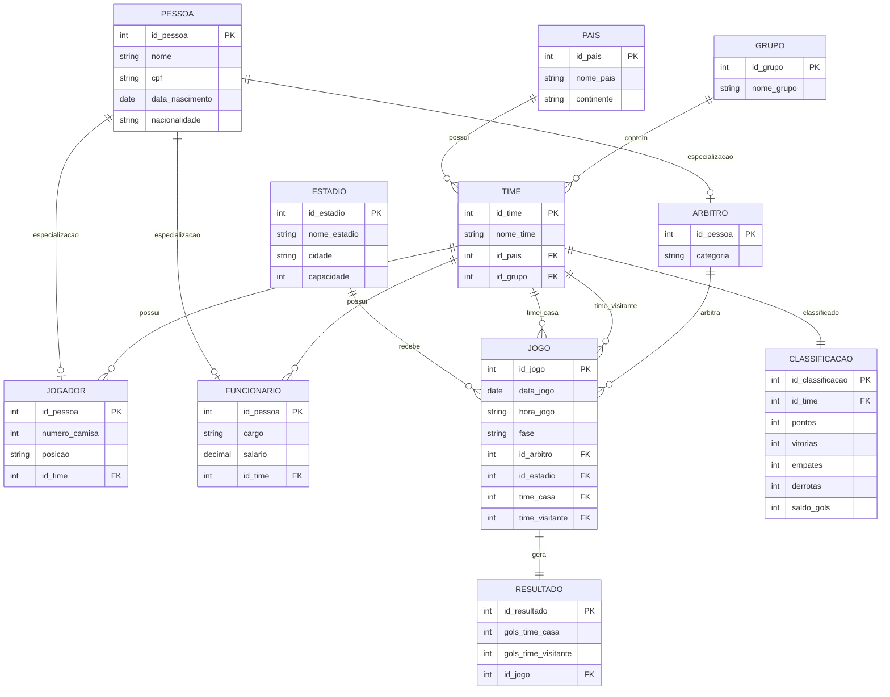

# 🏆 Sistema de Gerenciamento da Copa do Mundo 2026

Projeto de modelagem de banco de dados desenvolvido para representar as informações da Copa do Mundo FIFA 2026, contemplando países participantes, seleções, jogadores, grupos, partidas, resultados e classificação das equipes.

---

# 📖 Sobre o Projeto

Este projeto consiste na modelagem conceitual de um banco de dados relacional para gerenciar os principais dados de uma edição da Copa do Mundo.

O sistema foi desenvolvido com o objetivo de armazenar e organizar informações relacionadas aos países participantes, seleções nacionais, jogadores, comissão técnica, árbitros, estádios, jogos, resultados e classificação dos times durante a competição.

A modelagem foi construída aplicando conceitos fundamentais da disciplina de Banco de Dados, como:

* Entidades e Relacionamentos
* Cardinalidade
* Chaves Primárias (PK)
* Chaves Estrangeiras (FK)
* Generalização e Especialização
* Integridade Referencial
* Normalização de Dados

---
# 🗂 Modelo Entidade-Relacionamento

### Resumo do Modelo

O banco de dados foi estruturado para representar os principais elementos da Copa do Mundo 2026.

* **PAIS** representa os países participantes.
* **TIME** representa as seleções nacionais vinculadas aos seus países e grupos.
* **GRUPO** organiza os times na fase de grupos.
* **JOGADOR** armazena os atletas pertencentes a cada seleção.
* **FUNCIONARIO** representa a comissão técnica e demais membros da equipe.
* **ARBITRO** representa os responsáveis pela arbitragem das partidas.
* **ESTADIO** armazena os locais onde os jogos são realizados.
* **JOGO** registra as partidas da competição.
* **RESULTADO** guarda os placares dos jogos.
* **CLASSIFICACAO** mantém a pontuação e o desempenho dos times durante o torneio.

A utilização da entidade **PESSOA** permite aplicar o conceito de especialização, evitando redundância de dados comuns entre jogadores, funcionários e árbitros.

---
# 🎯 Objetivos

O projeto tem como principais objetivos:

* Representar os países participantes da Copa do Mundo 2026;
* Controlar informações das seleções nacionais;
* Gerenciar jogadores e comissão técnica;
* Registrar partidas e resultados;
* Organizar os grupos da competição;
* Armazenar a classificação das equipes;
* Aplicar boas práticas de modelagem de banco de dados.

---

# 🗂 Modelo Entidade-Relacionamento

## Entidades Principais

### PAIS

Representa os países participantes da competição.

**Atributos:**

* id_pais (PK)
* nome_pais
* continente

---

### GRUPO

Representa os grupos da fase inicial da Copa do Mundo.

**Atributos:**

* id_grupo (PK)
* nome_grupo

Exemplos:

* Grupo A
* Grupo B
* Grupo C

---

### TIME

Representa uma seleção nacional participante do torneio.

**Atributos:**

* id_time (PK)
* nome_time
* id_pais (FK)
* id_grupo (FK)

Cada time pertence a um país e a um grupo.

---

### PESSOA

Entidade genérica utilizada para evitar redundância de dados.

**Atributos:**

* id_pessoa (PK)
* nome
* cpf
* data_nascimento
* nacionalidade

A partir desta entidade são derivadas as especializações:

* Jogador
* Funcionário
* Árbitro

---

### JOGADOR

Representa um atleta pertencente a uma seleção.

**Atributos:**

* id_pessoa (PK/FK)
* numero_camisa
* posicao
* id_time (FK)

---

### FUNCIONARIO

Representa membros da comissão técnica ou equipe administrativa.

**Atributos:**

* id_pessoa (PK/FK)
* cargo
* salario
* id_time (FK)

---

### ARBITRO

Representa os árbitros responsáveis pelas partidas.

**Atributos:**

* id_pessoa (PK/FK)
* categoria

---

### ESTADIO

Representa os locais onde os jogos são realizados.

**Atributos:**

* id_estadio (PK)
* nome_estadio
* cidade
* capacidade

---

### JOGO

Representa uma partida da Copa do Mundo.

**Atributos:**

* id_jogo (PK)
* data_jogo
* hora_jogo
* fase
* id_arbitro (FK)
* id_estadio (FK)
* time_casa (FK)
* time_visitante (FK)

---

### RESULTADO

Armazena o placar final das partidas.

**Atributos:**

* id_resultado (PK)
* gols_time_casa
* gols_time_visitante
* id_jogo (FK)

---

### CLASSIFICACAO

Representa o desempenho de cada seleção dentro da competição.

**Atributos:**

* id_classificacao (PK)
* id_time (FK)
* pontos
* vitorias
* empates
* derrotas
* saldo_gols

Essa entidade permite acompanhar a posição dos times em seus respectivos grupos.

---

# 🔗 Relacionamentos

## País → Time

Um país pode possuir uma seleção participante.

Relacionamento:

PAIS (1) → (N) TIME

---

## Grupo → Time

Um grupo contém vários times.

Relacionamento:

GRUPO (1) → (N) TIME

---

## Time → Jogador

Um time possui vários jogadores.

Relacionamento:

TIME (1) → (N) JOGADOR

---

## Time → Funcionário

Um time possui vários funcionários.

Relacionamento:

TIME (1) → (N) FUNCIONARIO

---

## Time → Classificação

Cada time possui uma classificação.

Relacionamento:

TIME (1) → (1) CLASSIFICACAO

---

## Estádio → Jogo

Um estádio pode receber várias partidas.

Relacionamento:

ESTADIO (1) → (N) JOGO

---

## Árbitro → Jogo

Um árbitro pode apitar várias partidas.

Relacionamento:

ARBITRO (1) → (N) JOGO

---

## Jogo → Resultado

Cada jogo possui um resultado.

Relacionamento:

JOGO (1) → (1) RESULTADO

---

# 🧠 Decisões de Modelagem

## Generalização e Especialização

A entidade PESSOA foi criada para evitar repetição de informações.

Dados como:

* nome
* CPF
* data de nascimento
* nacionalidade

são armazenados apenas uma vez.

As entidades JOGADOR, FUNCIONARIO e ARBITRO herdam essas informações através de especialização.

---

## Separação entre Jogo e Resultado

A entidade RESULTADO foi separada da entidade JOGO para permitir o cadastro antecipado das partidas.

Assim, jogos futuros podem existir sem que seja necessário informar um placar.

---

## Classificação Independente

A entidade CLASSIFICACAO foi criada para representar a tabela de desempenho das seleções.

Ela armazena:

* Pontuação
* Vitórias
* Empates
* Derrotas
* Saldo de gols

permitindo acompanhar a classificação dos grupos da Copa do Mundo.

---

# 📊 Benefícios da Modelagem

* Redução de redundância de dados;
* Melhor organização das informações;
* Facilidade para consultas SQL;
* Facilidade para expansão futura;
* Maior integridade dos dados;
* Estrutura compatível com sistemas reais de competições esportivas.

---

# 🛠 Tecnologias Utilizadas

* Mermaid ER Diagram
* Markdown
* Modelagem Conceitual de Banco de Dados

---

# 👨‍💻 Autor

Projeto desenvolvido para a disciplina de Banco de Dados.

**Tema:** Copa do Mundo FIFA 2026

**Aluno:** (Seu Nome)

**Curso:** (Seu Curso)

**Instituição:** (Sua Instituição)
