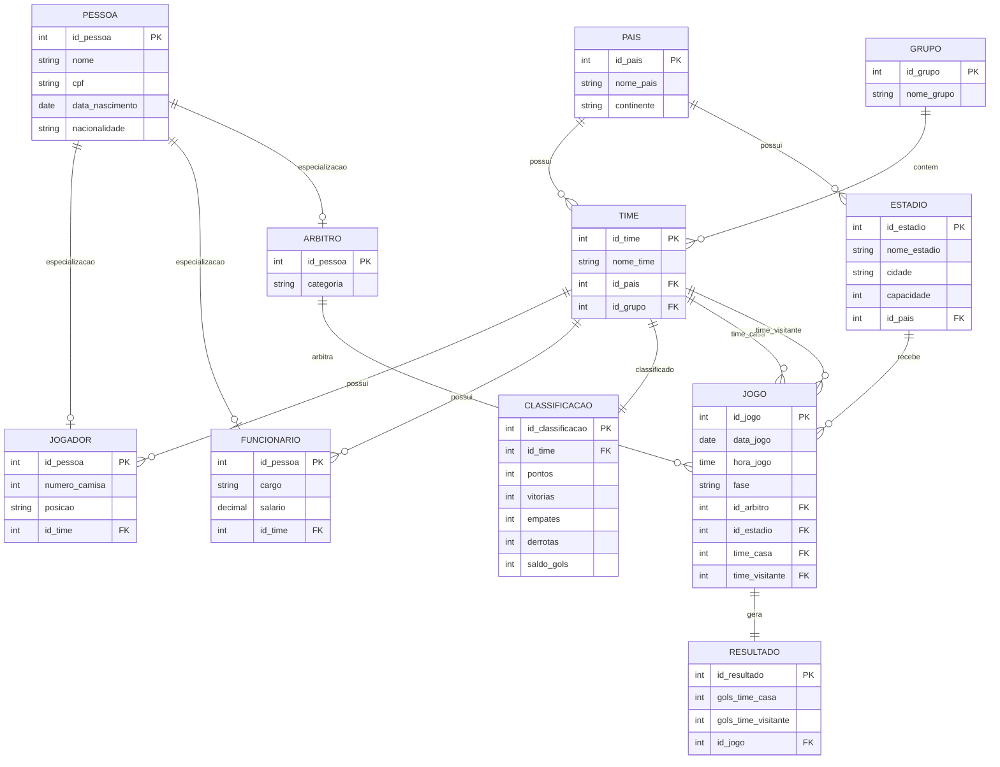

# 🏆 Sistema de Gerenciamento da Copa do Mundo FIFA 2026

## 📖 Descrição do Projeto

Este projeto consiste na modelagem de um banco de dados relacional para gerenciamento das informações da Copa do Mundo FIFA 2026.

O sistema foi projetado para armazenar dados relacionados aos países participantes, grupos, seleções, jogadores, funcionários técnicos, árbitros, estádios, jogos, resultados e classificação do torneio.

A modelagem segue os princípios de normalização de banco de dados, garantindo integridade, organização e redução de redundâncias.

---

# 🎯 Objetivos

- Cadastrar países participantes.
- Organizar seleções em grupos.
- Gerenciar jogadores das seleções.
- Gerenciar comissões técnicas e funcionários.
- Registrar árbitros.
- Controlar estádios e cidades-sede.
- Agendar partidas.
- Registrar resultados dos jogos.
- Gerar classificações das equipes.

---

# 📊 Modelo Entidade-Relacionamento (MER)

## ✅ Normalização

- 1FN: Atendida
- 2FN: Atendida
- 3FN: Atendida
- BCNF: Atendida
- 4FN: Atendida
- 5FN: Atendida

## 🚀 Tecnologias

- PostgreSQL
- pgAdmin
- DBeaver
- Mermaid
- GitHub

## 📌 Conclusão

Modelo de banco de dados desenvolvido para a Copa do Mundo FIFA 2026, contemplando países, grupos, seleções, jogadores, funcionários, árbitros, estádios, jogos, resultados e classificação, seguindo boas práticas de modelagem e normalização.
