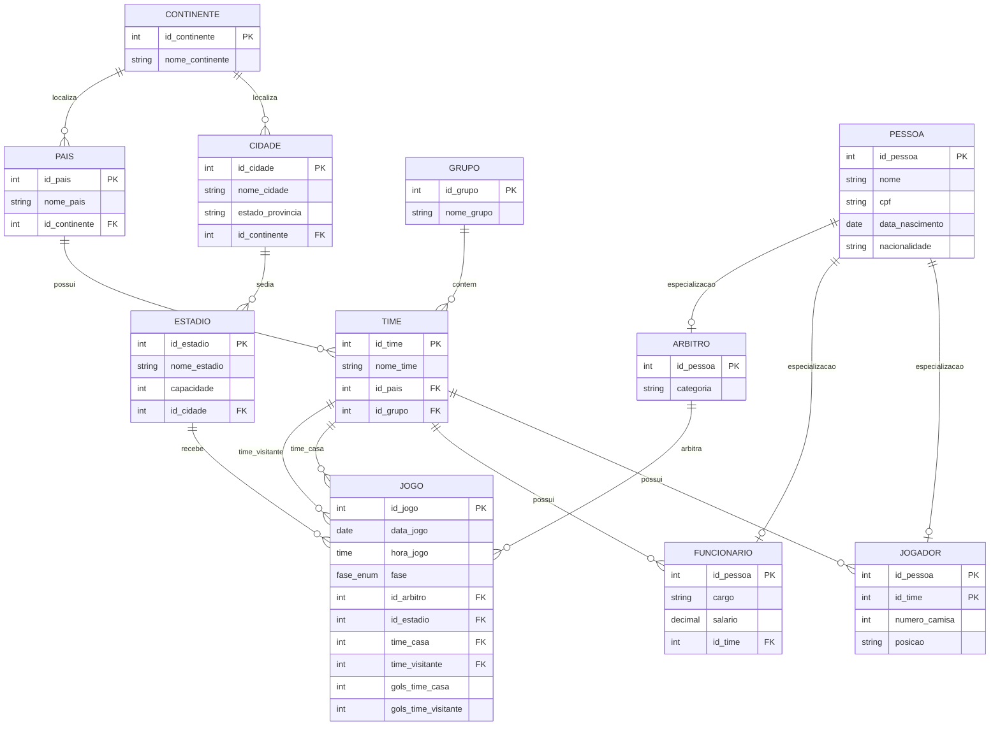

# 🏆 Sistema de Gerenciamento da Copa do Mundo 2026

Projeto de modelagem de banco de dados desenvolvido para representar as informações da Copa do Mundo FIFA 2026, contemplando países participantes, seleções, jogadores, grupos, partidas e classificação das equipes, com schema **normalizado até a BCNF**.

---

# 📖 Sobre o Projeto

Este projeto consiste na modelagem de um banco de dados relacional para gerenciar os principais dados de uma edição da Copa do Mundo.

O sistema armazena e organiza informações relacionadas a países, continentes, cidades, seleções nacionais, jogadores, comissão técnica, árbitros, estádios, jogos e classificação dos times durante a competição.

A modelagem aplica conceitos fundamentais de Banco de Dados:

* Entidades e Relacionamentos
* Cardinalidade
* Chaves Primárias (PK) simples e compostas
* Chaves Estrangeiras (FK)
* Generalização e Especialização
* Integridade Referencial
* Normalização de Dados (1FN, 2FN, 3FN, BCNF, 5FN)

---

# 🗂 Modelo Entidade-Relacionamento



### Resumo do Modelo

* **CONTINENTE** representa os continentes — separado de PAIS para evitar dependência transitiva (3FN).
* **CIDADE** representa as cidades sede — separada de ESTADIO para evitar repetição de dados (3FN).
* **PAIS** representa os países participantes, vinculados ao seu continente via FK.
* **GRUPO** organiza os times na fase de grupos.
* **TIME** representa as seleções nacionais, vinculadas ao país e ao grupo.
* **PESSOA** é a entidade genérica base das especializações (generalização).
* **JOGADOR** é especialização de PESSOA com chave composta `(id_pessoa, id_time)`.
* **FUNCIONARIO** representa a comissão técnica.
* **ARBITRO** representa os árbitros das partidas.
* **ESTADIO** armazena os locais dos jogos, com FK para CIDADE.
* **JOGO** registra as partidas com resultado embutido (gols direto na tabela) e fase controlada por ENUM.
* **CLASSIFICACAO** é uma VIEW calculada automaticamente a partir de JOGO — não armazena dados derivados.

---

# 🎯 Objetivos

* Representar os países e continentes participantes da Copa do Mundo 2026;
* Controlar informações das seleções nacionais;
* Gerenciar jogadores e comissão técnica;
* Registrar partidas e resultados;
* Organizar os grupos da competição;
* Calcular a classificação das equipes automaticamente via VIEW;
* Aplicar boas práticas de normalização de banco de dados.

---

# 🗂 Entidades

### CONTINENTE

Representa os continentes geográficos. Extraída de PAIS para eliminar dependência transitiva (3FN).

**Atributos:**

* id_continente (PK)
* nome_continente (UNIQUE)

---

### CIDADE

Representa as cidades sede dos estádios. Extraída de ESTADIO para eliminar repetição de dados (3FN).

**Atributos:**

* id_cidade (PK)
* nome_cidade
* estado_provincia
* id_continente (FK → CONTINENTE)

---

### PAIS

Representa os países participantes da competição.

**Atributos:**

* id_pais (PK)
* nome_pais
* id_continente (FK → CONTINENTE)

> **Correção 3FN:** o campo `continente` foi removido de PAIS e substituído por FK para CONTINENTE, eliminando a dependência transitiva `id_pais → nome_pais → continente`.

---

### GRUPO

Representa os grupos da fase inicial da Copa do Mundo.

**Atributos:**

* id_grupo (PK)
* nome_grupo (UNIQUE)

Exemplos: Grupo A, Grupo B, Grupo C...

---

### TIME

Representa uma seleção nacional participante do torneio.

**Atributos:**

* id_time (PK)
* nome_time
* id_pais (FK → PAIS)
* id_grupo (FK → GRUPO)

---

### PESSOA

Entidade genérica utilizada para evitar redundância de dados entre especializações.

**Atributos:**

* id_pessoa (PK)
* nome
* cpf
* data_nascimento
* nacionalidade

Derivações: JOGADOR, FUNCIONARIO, ARBITRO.

---

### JOGADOR

Representa um atleta pertencente a uma seleção.

**Atributos:**

* id_pessoa (PK → referencia PESSOA)
* id_time (PK → referencia TIME)
* numero_camisa
* posicao

> **Correção 2FN:** a PK era apenas `id_pessoa`. Como `numero_camisa` e `posicao` dependem do par jogador+time (um mesmo atleta pode usar números diferentes em seleções diferentes), a chave primária agora é composta: `(id_pessoa, id_time)`.

---

### FUNCIONARIO

Representa membros da comissão técnica ou equipe administrativa.

**Atributos:**

* id_pessoa (PK → referencia PESSOA)
* cargo
* salario
* id_time (FK → TIME)

---

### ARBITRO

Representa os árbitros responsáveis pelas partidas.

**Atributos:**

* id_pessoa (PK → referencia PESSOA)
* categoria

---

### ESTADIO

Representa os locais onde os jogos são realizados.

**Atributos:**

* id_estadio (PK)
* nome_estadio
* capacidade
* id_cidade (FK → CIDADE)

> **Correção 3FN:** o campo `cidade` (string) foi removido e substituído por FK para CIDADE, eliminando repetição e risco de inconsistência de digitação.

---

### JOGO

Representa uma partida da Copa do Mundo.

**Atributos:**

* id_jogo (PK)
* data_jogo (DATE)
* hora_jogo (TIME)
* fase (ENUM: `grupos`, `oitavas`, `quartas`, `semifinal`, `final`, `terceiro_lugar`)
* id_arbitro (FK → ARBITRO)
* id_estadio (FK → ESTADIO)
* time_casa (FK → TIME)
* time_visitante (FK → TIME)
* gols_time_casa (NULL enquanto jogo não realizado)
* gols_time_visitante (NULL enquanto jogo não realizado)


> **Agregação:** `A entidade JOGO representa uma agregação de relacionamentos entre TIMES, ESTÁDIO e ÁRBITRO, concentrando informações do evento esportivo.
> 
> **Correção 1FN:** `fase` era `VARCHAR` livre, permitindo inconsistências como `"Fase de Grupos"` e `"fase de grupos"`. Substituído por `ENUM` com valores controlados.
>
> **Correção BCNF:** a tabela `RESULTADO` foi eliminada. Ela tinha relação 1:1 com `JOGO` e `id_jogo` já seria chave suficiente — a separação não acrescentava semântica. Os gols foram movidos para dentro de `JOGO`, com `NULL` representando jogos futuros (substitui a justificativa original de separação).

---

### CLASSIFICACAO (VIEW)

Calcula automaticamente o desempenho de cada seleção a partir dos resultados de `JOGO`.

**Colunas calculadas:**

* id_time, id_grupo, nome_grupo, nome_time
* vitorias, empates, derrotas
* pontos
* saldo_gols, gols_pro, gols_contra

> **Correção 3FN:** a tabela `CLASSIFICACAO` armazenava dados derivados (`pontos`, `saldo_gols`, `vitorias` etc.) que poderiam ficar inconsistentes se os resultados fossem alterados. Substituída por uma VIEW que recalcula tudo automaticamente.
>
> **Correção 2FN:** a tabela original não tinha `id_grupo`, criando uma dependência parcial implícita num torneio com múltiplos grupos. A VIEW já agrupa por `id_grupo` corretamente.

Para consultar:

```sql
SELECT * FROM classificacao ORDER BY nome_grupo, pontos DESC, saldo_gols DESC;
```

---

# 🔗 Relacionamentos

| Relação | Cardinalidade |
|---|---|
| CONTINENTE → PAIS | 1:N |
| CONTINENTE → CIDADE | 1:N |
| PAIS → TIME | 1:N |
| GRUPO → TIME | 1:N |
| CIDADE → ESTADIO | 1:N |
| PESSOA → JOGADOR | 1:0\|1 (especialização) |
| PESSOA → FUNCIONARIO | 1:0\|1 (especialização) |
| PESSOA → ARBITRO | 1:0\|1 (especialização) |
| TIME → JOGADOR | 1:N (via chave composta) |
| TIME → FUNCIONARIO | 1:N |
| ESTADIO → JOGO | 1:N |
| ARBITRO → JOGO | 1:N |
| TIME → JOGO (casa) | 1:N |
| TIME → JOGO (visitante) | 1:N |

---

# 🧠 Decisões de Modelagem

## Generalização e Especialização

A entidade PESSOA centraliza dados comuns a jogadores, funcionários e árbitros (nome, CPF, data de nascimento, nacionalidade), evitando redundância. As especializações herdam via FK com a mesma PK.

## Chave Composta em JOGADOR

`numero_camisa` e `posicao` são atributos do vínculo entre um atleta e uma seleção específica, não do atleta em si. A chave `(id_pessoa, id_time)` torna esse vínculo explícito e correto.

## Gols embutidos em JOGO

A tabela `RESULTADO` foi eliminada por ser uma relação 1:1 sem atributos próprios que justificassem a separação. Jogos futuros usam `NULL` nos campos de gol, mantendo a semântica de "não realizado".

## Classificação como VIEW

Dados como pontos e saldo de gols são sempre derivados dos resultados dos jogos. Armazená-los em tabela separada criava o risco de divergência. A VIEW garante que a classificação esteja sempre sincronizada com os resultados reais.

## Continente e Cidade como Entidades

Extrair `continente` de PAIS e `cidade` de ESTADIO elimina dependências transitivas (3FN) e evita inconsistências de digitação — por exemplo, "São Paulo" vs "Sao Paulo".

---

# 📊 Normalização Aplicada

| Forma Normal | Status | Principal correção |
|---|---|---|
| 1FN | ✅ Aplicada | `fase` tipado como ENUM; `hora_jogo` como TIME |
| 2FN | ✅ Aplicada | Chave composta `(id_pessoa, id_time)` em JOGADOR; `id_grupo` em CLASSIFICACAO |
| 3FN | ✅ Aplicada | CONTINENTE e CIDADE separados; CLASSIFICACAO virou VIEW |
| BCNF | ✅ Aplicada | RESULTADO eliminada (relação 1:1 com JOGO) |
| 5FN | ✅ Conforme | Sem dependências de junção que exijam decomposição |

---

# 🛠 Tecnologias Utilizadas

* Mermaid ER Diagram
* Markdown
* Modelagem Relacional de Banco de Dados
* PostgreSQL (DDL e DML)
* Supabase para execução dos scripts

---

# 👨‍💻 Autores

Projeto desenvolvido para a disciplina de Banco de Dados.

**Tema:** Copa do Mundo FIFA 2026

**Aluno:** Juan Lima Machado

**Aluno:** Isac Alves de Lima Silva

**Curso:** Ciência da Computação

**Instituição:** Afya São Lucas — Porto Velho-RO
