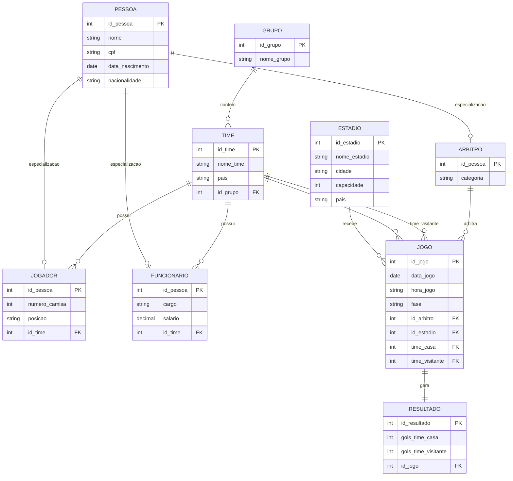

# 🏆 Sistema de Gerenciamento de Campeonato de Futebol

Projeto de modelagem de banco de dados para um sistema de gerenciamento de campeonato de futebol, contemplando grupos, times, jogadores, comissão técnica, árbitros, estádios, jogos e resultados.

---

## 📋 Sumário

- [Sobre o projeto](#-sobre-o-projeto)
- [Objetivos](#-objetivos)
- [Modelo Entidade-Relacionamento](#-modelo-entidade-relacionamento)
- [Descrição das entidades](#-descrição-das-entidades)
- [Decisões de modelagem](#-decisões-de-modelagem)
- [Possíveis extensões futuras](#-possíveis-extensões-futuras)
- [Tecnologias utilizadas](#-tecnologias-utilizadas)
- [Autor](#-autor)

---

## 📖 Sobre o projeto

Este projeto consiste na modelagem conceitual de um banco de dados relacional para gerenciar as informações de um campeonato de futebol, incluindo o cadastro de times organizados por grupos, pessoas (que podem atuar como jogadores, membros da comissão técnica/funcionários ou árbitros), estádios, partidas e seus respectivos resultados.

O modelo foi desenvolvido como solução para a disciplina de **Banco de Dados**, com foco na aplicação prática dos conceitos de:

- Entidades e relacionamentos
- Cardinalidade
- Chaves primárias (PK) e estrangeiras (FK)
- Generalização/especialização (herança em modelagem ER)

---

## 🎯 Objetivos

- Representar de forma clara a estrutura de dados de um campeonato de futebol;
- Evitar redundância de dados pessoais entre jogadores, funcionários e árbitros através de especialização;
- Modelar corretamente relacionamentos entre times e partidas, incluindo o caso de duas referências de uma entidade para a mesma tabela (time da casa e visitante);
- Aplicar boas práticas de modelagem conceitual antes da implementação física do banco de dados.

---

## 🗂 Modelo Entidade-Relacionamento

> 💡 Esse bloco de código é renderizado automaticamente como diagrama em plataformas como GitHub, GitLab e editores com suporte a Mermaid.

---

## 🧩 Descrição das entidades

| Entidade | Descrição |
|---|---|
| **PESSOA** | Entidade genérica que armazena os dados pessoais comuns a qualquer indivíduo cadastrado no sistema. |
| **JOGADOR** | Especialização de Pessoa. Representa um atleta vinculado a um time, com número de camisa e posição. |
| **FUNCIONARIO** | Especialização de Pessoa. Representa membros da comissão técnica ou demais cargos administrativos de um time. |
| **ARBITRO** | Especialização de Pessoa. Representa os árbitros responsáveis por conduzir as partidas. |
| **GRUPO** | Agrupamento de times dentro da fase de grupos do campeonato. |
| **TIME** | Representa uma equipe participante, vinculada a um grupo. |
| **ESTADIO** | Local físico onde as partidas são realizadas. |
| **JOGO** | Representa uma partida, vinculando dois times (casa e visitante), um árbitro e um estádio. |
| **RESULTADO** | Armazena o placar final de uma partida específica. |

---

## 🧠 Decisões de modelagem

**1. Generalização/Especialização (Pessoa → Jogador, Funcionário, Árbitro)**
Optou-se por centralizar os dados pessoais comuns (nome, CPF, nascimento, nacionalidade) na entidade `PESSOA`, evitando duplicação de informação. Cada especialização herda a chave primária da entidade-mãe (`id_pessoa`) como sua própria PK e FK.

A cardinalidade entre `PESSOA` e cada especialização é **`||--o|`** (um-para-zero-ou-um), pois uma pessoa cadastrada não é obrigatoriamente jogador, funcionário e árbitro ao mesmo tempo — ela pode assumir apenas um desses papéis, ou nenhum.

**2. Relacionamento duplo entre TIME e JOGO**
Como uma partida envolve dois times distintos (casa e visitante) e ambos referenciam a mesma tabela `TIME`, foram criadas duas chaves estrangeiras separadas (`time_casa` e `time_visitante`) dentro de `JOGO`, em vez de uma única FK ambígua.

**3. Separação entre JOGO e RESULTADO**
O resultado da partida foi modelado como entidade separada do jogo, permitindo representar partidas que ainda não ocorreram (sem resultado lançado) sem a necessidade de campos nulos dentro da própria tabela `JOGO`.

**4. Jogadores e funcionários vinculados a um único time**
No escopo atual (um campeonato específico), cada jogador e funcionário pertence a exatamente um time. Essa modelagem é suficiente para representar uma única edição do torneio, mas não preserva histórico de transferências entre temporadas (ver seção de extensões futuras).

---

## 🔮 Possíveis extensões futuras

- **Histórico de vínculo com times**: criar uma tabela associativa (ex: `HISTORICO_TIME`) com datas de início/fim, permitindo que um jogador ou funcionário tenha passado por múltiplos times ao longo do tempo.
- **Eventos detalhados de jogo**: criar uma entidade `EVENTO_JOGO` para registrar gols (autor, minuto), cartões amarelos/vermelhos e substituições, hoje não contemplados em `RESULTADO`.
- **Múltiplos árbitros por partida**: hoje o modelo contempla apenas um árbitro principal por jogo; poderia ser expandido para incluir árbitros assistentes e árbitro de VAR.

---

## 🛠 Tecnologias utilizadas

- **Diagramação:** [Mermaid.js](https://mermaid.js.org/) (sintaxe `erDiagram`)
- **Documentação:** Markdown

---

## 👤 Autor

Desenvolvido como trabalho acadêmico da disciplina de Banco de Dados.

*(Adicione aqui seu nome, curso/turma e instituição.)*
